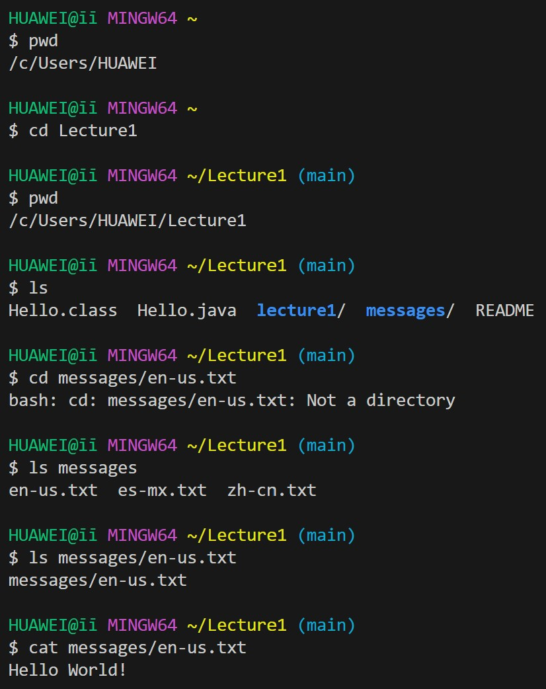

# Lab Report 1
## Share an example of using the command with no arguments.
 
command `cd`:  
1. absolute path before command was run: `/c/Users/HUAWEI`. 
2. Explanation: Running `cd` command with no arguments changes the current directory to the user's home directory. 
3. Output: It is not an error. 
command `ls`: 
1. absoluate path before command was run: `/c/Users/HUAWEI`. 
2. Explanation: Running `ls` with no arguments lists the contents of the current directory. 
3. Output: It is not an error. 
command `cat`: 
1. absolute path before command was run: `/c/Users/HUAWEI`. 
2. Explanation: Running `cat` command with no arguments tries to display the contents of a non-existent file that the terminal will wait for my input something.This behavior will end when I press ctrl+z. 
3. Output: It is not an error. 
## Share an example of using the command with a path to a directory as an argument.
 
command `cd ./lecture1`: 
1. absolute path before command was run: `/c/Users/HUAWEI`. 
2. Explanation: Running `cd ./lecture1` changes the current directory to the specified directory. 
3. Output: It is not an error. 
command `ls ./lecture1`: 
1. absoluate path before command was run: `/c/Users/HUAWEI`. 
2. Explanation: Running `ls ./lecture1` lists the contents of the specified directory. 
3. Output: It is not an error and it output is `Hello.class  Hello.java  messages/  README`. 
command `cat ./lecture1`: 
1. absoulate path before command was run: `/c/Users/HUAWEI`. 
2. Explanation: Running `cat ./lecture1` tries to display the contents of a directory, which is not allowed. 
3. Output: It is error. `cat: ./lecture1: Is a directory`, because `cat` cannot directly print a directory. 
## Share an example of using the command with a path to a file as an argument.
 
command `cd messages/en-us.txt`: 
1. absoluate path before command was run: `/c/Users/HUAWEI`. 
2. Explanation: Running `cd messages/en-us.txt` tries to change the current directory to a file, which is not allowed, because `cd` cannot open a file. There is txt named en-us.txt inside messages 
3. Output: It is error. `bash: cd: messages/en-us.txt: Not a directory`. `cd` can be use to direct into a folder but it is not able to open a file. 
command `ls messages/en-us.txt`: 
1. absoluate path before command was run: `/c/Users/HUAWEI`. 
2. Explanation: Running `ls messages/en-us.txt` displays the contents of the specified file. 
3. Output: It is not an error and it output is `messages/en-us.txt` 
command `cat messages/en-us.txt`: 
1. absoluate path before command was run: `/c/Users/HUAWEI`. 
2. Explanation: Running `cat messages/en-us.txt` displays the contents of the specified file. 
3. Output: It is not an error, and it output is `Hello World!` 

