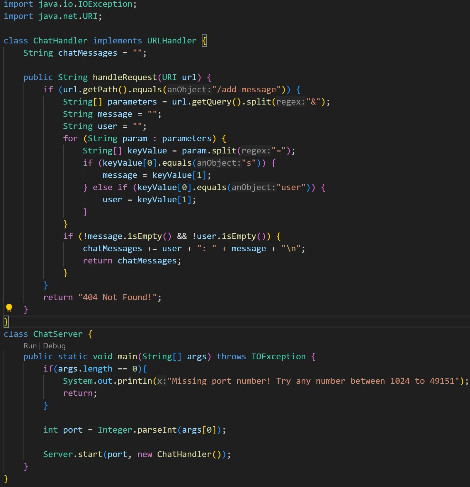
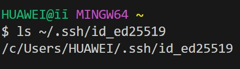

# Lab Report 2
## Part1:
 
.jpg) 
1. method: `handleRequest`.
2. `handleRequest`: `url.getPath()` = `"/add-message"`,`url.getQuery()` = `"s=Hello&user=jpolitz"`,`chatMessages` = `""` 
`String.split`: `"s=Hello&user=jpolitz"` 
`String.equals`: `"s"`, `"user"` 
`String.isEmpty`: `"Hello"`, `"jpolitz"` 
`String.+=`: `"jpolitz: Hello\n"` 
3. `chatMessages` changes from `""` to `"jpolitz: Hello\n"` 
.jpg) 
1. method: `handleRequest`.
2. `handleRequest`: `url.getPath()`= `"/add-message"`, `url.getQuery()` = `"s=How%20are%20you&user=yash"`, `chatMessages` = `"jpolitz: Hello\n"` 
`String.split`: `"s=How%20are%20you&user=yash"` 
`String.equals`: `"s"`, `"user"` 
`String.isEmpty`: `"How are you"`, `"yash"` 
`String.+=`: `"jpolitz: Hello\nyash: How are you\n"` 
3. `chatMessages` changes from `"jpolitz: Hello\n"` to `"jpolitz: Hello\nyash: How are you\n"` 
## Part2:
 
.jpg) 
.jpg) 
## Part3: 
In week2 lab, I learned about the URLHandler interface, which allows for flexible handling of different types of URLs within a web server application. Additionally, in week3 lab, I gained a deeper understanding of SSH keys and SCP, particularly in the context of secure remote server access and file transfer. Learning how to generate, manage, and utilize SSH keys for authentication and SCP for secure file transfer enhanced my proficiency in securely interacting with remote servers and transferring files between local and remote environments.
