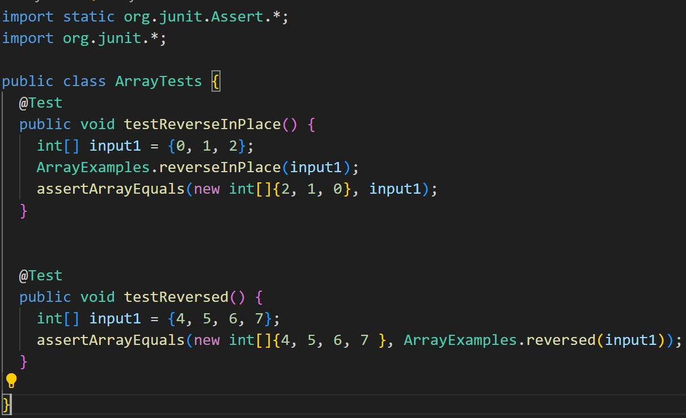
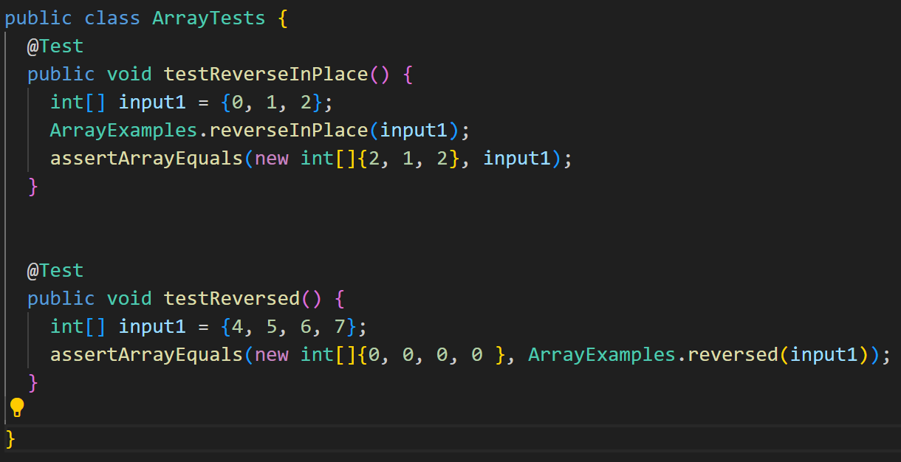
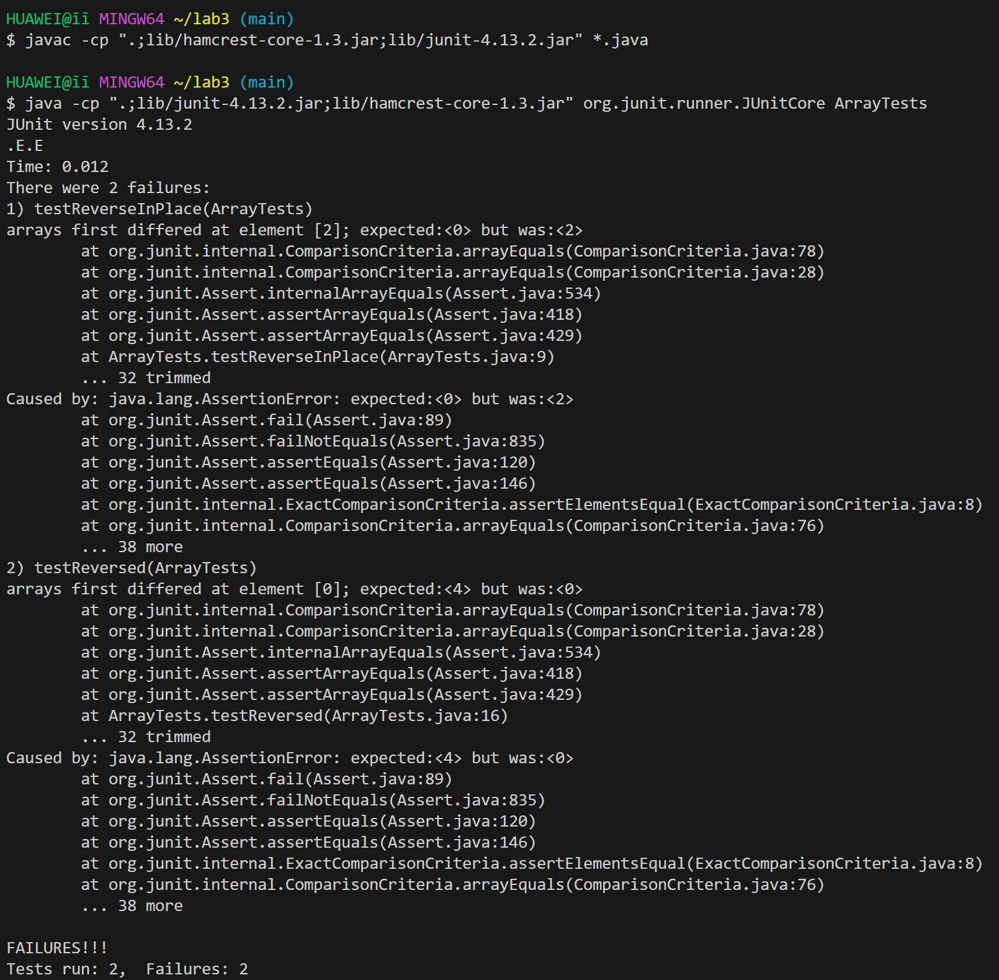
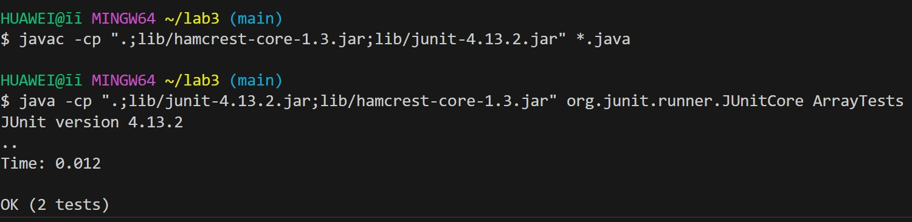
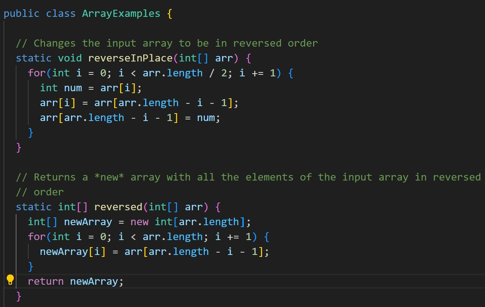
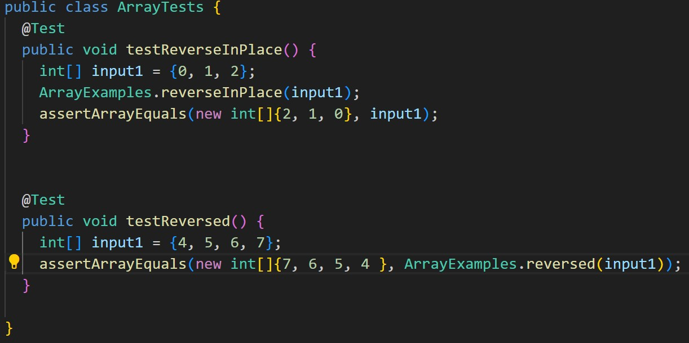
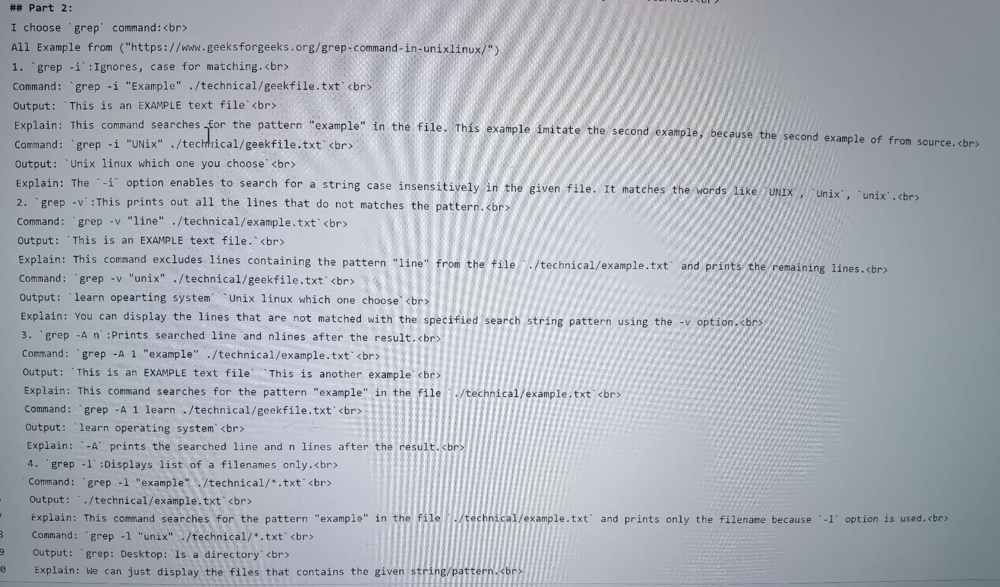

# Lab Report 3
## Part 1:
 
 
 
 
 
 
5. For `reverseInPlace`, you can switch the value until it reaches half of the array, and then use a placeholder to make the latter half equal to the first half. For the `reversed` method, you need to ensure that `newArray` is updated with the `reversed` value from the `arr`, and then `newArray` is returned. 
## Part 2:
 
