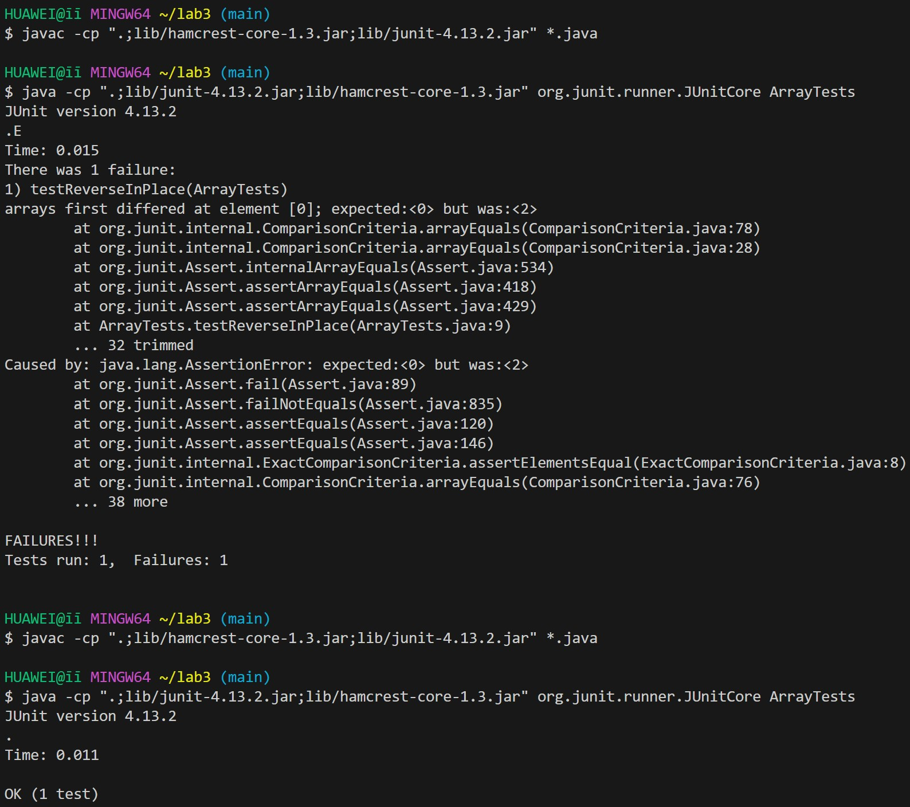

# Lab Report 3
## Part 1:
1. ```
   @Test
   public void testReverseInPlace(){
     int[] input1= {0, 1, 2};
     ArrayExamples.reverseInPlace(input1);
     assertArrayEquals(new int[]{0, 1, 2}, input1);
   }
   ```
   <br>
2. ```
   @Test
   public void testReverseInPlace(){
     int[] input1= {0, 1, 2};
     ArrayExamples.reverseInPlace(input1);
     assertArrayEquals(new int[]{2, 1, 0}, input1);
   }
   ```
   <br>
3. <br>
4. ```
   static void reverseInPlace(int[] arr) {
    for(int i = 0; i < arr.length; i += 1) {
      arr[i] = arr[arr.length - i - 1];
    }
  }
  ```
  <br>
5. ```
   static void reverseInPlace(int[] arr) {
    for(int i = 0; i < arr.length / 2; i += 1) {
      int num = arr[i];
      arr[i] = arr[arr.length - i - 1];
      arr[arr.length - i - 1] = num;
    }
  }
  ```
   <br>
6. For `reverseInPlace`, you can switch the value until it reaches half of the array. Then use a placeholder to make the latter half equal to the first half This method ensures each elemtns is placed in its correct reversed position without overwriting values.<br>
## Part 2:
I choose `grep` command:<br>
All sources is from ("https://www.geeksforgeeks.org/grep-command-in-unixlinux/") by searching "grep command-line options".<br>
1. `grep -i`: Ignores, case for matching.<br>
Command: `grep -i ./technical "example" example.txt`.<br>
Output: `This is an EXAMPLE text file.``This is another example.`<br>
Explain: This command searches for the pattern "example" in the file`example.txt`, ignoring case distinctions. This output and explain are what I get in ChatGPT by typing command.<br>
Command: `grep -i ./technical "UNix" geekfile.txt`.<br>
Output: `Unix linux which one you choose.`<br>
Explain: The `-i` option enables to search for a string case insensitively in the given file. It matches the words like “UNIX”, “Unix”, “unix”. <br>
2. `grep -v`: This prints out all the lines that do not matches the pattern.<br>
Command: `grep -v "line" example.txt`<br>
Output: `This is an EXAMPLE text file.``This is another example.`<br>
Explain: This command excludes lines containing the pattern "line" from the file `example.txt` and prints the remaining lines.This output and expalain are what I get in ChatGPT by typing command.<br>
Command: `grep -v "unix" geekfile.txt`<br>
Output: `learn operation system``Unix linux which one you choose`<br>
Explain: The lines are not matched with the specified search string pattern using the `-v` option.<br>
3. `grep -A n`: Prints searched line and nlines after the result.<br>
Command: `grep -A 1 "example" example.txt`<br>
Output: `This is an EXAMPLE text file.``This is another example.`<br>
Explain: This command searches for the pattern "example" in the file `example.txt` and prints the matching line along with the next line after each match. This output and explain are what I get in ChatGPT by typing command.<br>
Command: `grep -A1 learn geekfile.txt`<br>
Output: learn operation system``Unix linux which one you choose`<br>
Explain: `-A` prints the searched line and n lines after the result.<br>
4. `grep -l`: Displays list of a filenames only.<br>
Command: `grep -l "example" example.txt`<br>
Output: `example.txt`<br>
Explain: This command searches for the pattern "example" in the file `example.txt` and prints only the filename because `-l` option is used. This output and expalain are what I get in ChatGPT by typing command.<br>
Command: `grep -l "unix" *`<br>
Output: `grep: Desktop: ls a directory``grep: Documents: ls a directory`<br>
Explain: The files contains the given string/pattern.<br>
