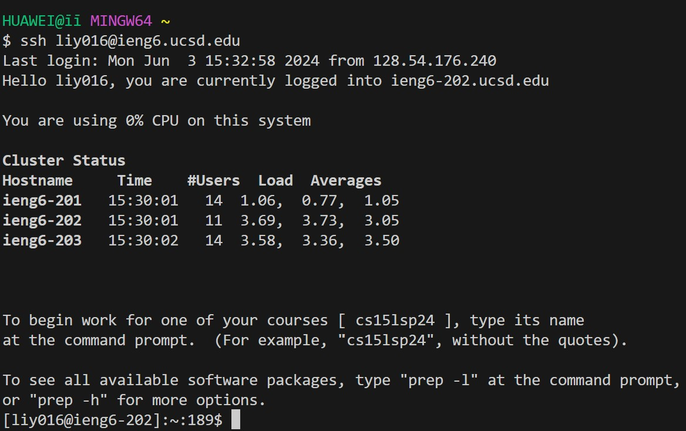
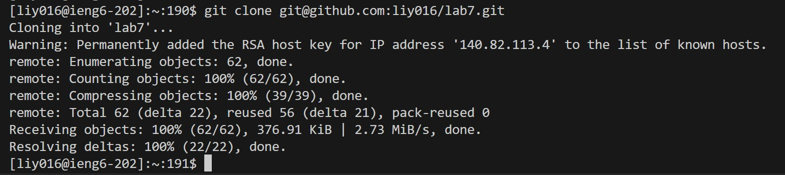
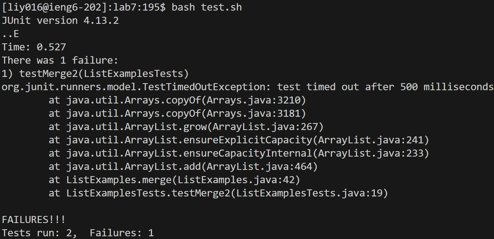
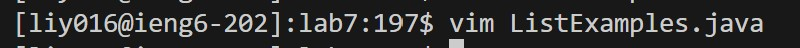
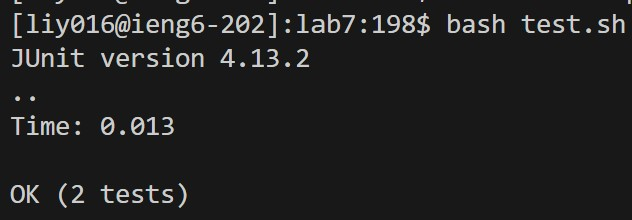
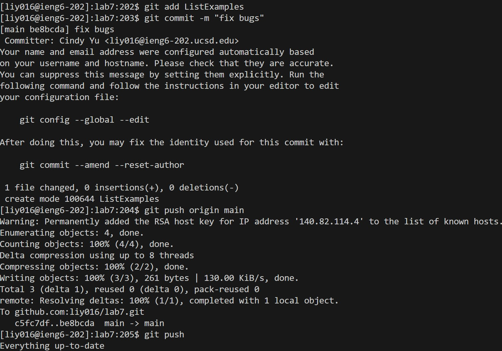

# Lab report 4
 
Keys pressed: `ssh<space>liy016@ieng6.ucsd.edu<enter>` 
Summary and Effect: command `ssh` is used to securely connect to a remote server ieng6 with the username liy016. The keypress is running various commands on the remote server after a successful login. 
 
Keys pressed:  `git<space>clone<space>git@github.com:liy016/lab7.git<enter>` 
Summary and Effect: command `git clone`clones the repository located at `git@github.com:liy016/lab7.git` to your local machine. The keypress initiates the cloning process and results in a local copy of the repository. 
 
Keys pressed:  `cd<space>lab7<enter>`, `bash<space>test.sh<enter>` 
Summary and Effect: command `cd` and `bash` are used to change the directory to lab7 and then execute the `test.sh` script. The keypresses change the directory and run the script. The effect of running `test.sh` depends on the content of the script. 
 
Keys pressed: `vim<space>ListExamples.java<enter>`, `:44<enter>`,`e`, `dw`, `i`, `<esc>`, `:wq<enter>` 
Summary and Effect: command `vim`, `:44`, `e`, `dw`, `i`, `<esc>` and `:wq`: command `vim` opens the file ListExamples.java in the Vim text editor aand switches the terminal to Vim displaying the file. Within Vim, `:44`(to move on to the error that produced an error),`e`(jump forwards to the end of a word), `dw`(delete 1), `i`(insert before the cursor and add 2 after the index), then use `<esc>`(escape from insertion), `:wq`(to save and exit) 
 
Keys pressed: `bash<space>test.sh<enter>` 
Summary and Effect: commmand `bash` execute the `test.sh` script and the effect of running `test.sh` depends on the content of the script. 
 
Keys pressed: `git<space>add<space>ListExamples<enter>`, `git<space>commit<space>-m<space>"fix<space>bugs"<enter>`, `git<sapce>push<enter>` 
Summary and Effect: command `git add`, `git commit` and `git push`: command `git add` stages changes to ListExamples for the next commit.The command `git commit` creates a new commit with the staged changes and the message "fix bugs". The command `git push` uploads the local commits to the remote repository, updating it with the latest changes. 
