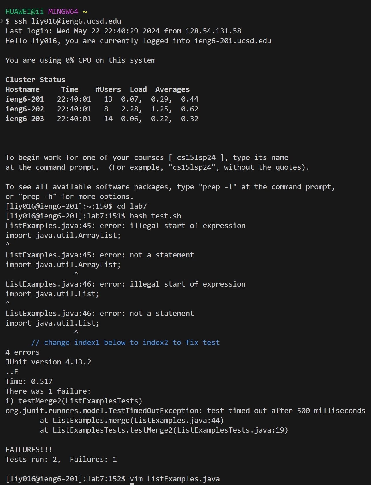

# Lab report 4
1.  
2. Keys pressed: `ssh<space>liy016@ieng6.ucsd.edu`, `git<space>clone<space>https://github.com/liy016/lab7.git`, `cd<space>lab7``bash<space>test.sh``vim<space>ListExamples.java`, `:44`(to move on to the error that produced an error),`e`(jump forwards to the end of a word), `dw`(delete 1), `i`(insert before the cursor and add 2 after the index), then use `<esc>`(escape from insertion), `:wq`(to save and exit), so `bash<space>test.sh`, `git<space>commit<space>-m<space>"Fixed the test"<enter>`, `git<space>push<space>origin<space>main<enter>` 
3. Effect: `ssh`: Logs into the ieng6 server.`git clone`: Clones the repository from GitHub. `cd`: Navigates to the directory. `bash`: run the test and show failing and passing tests. `vim`: Opens the specified file.
