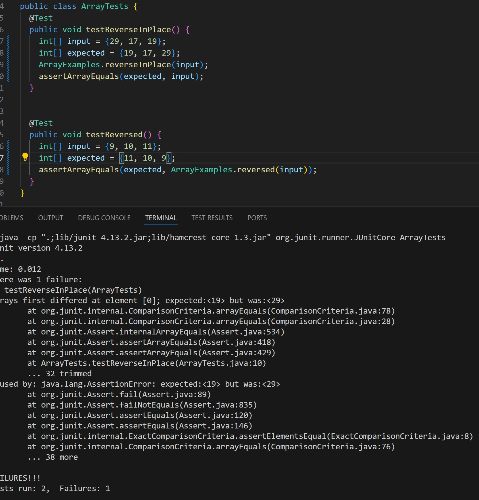
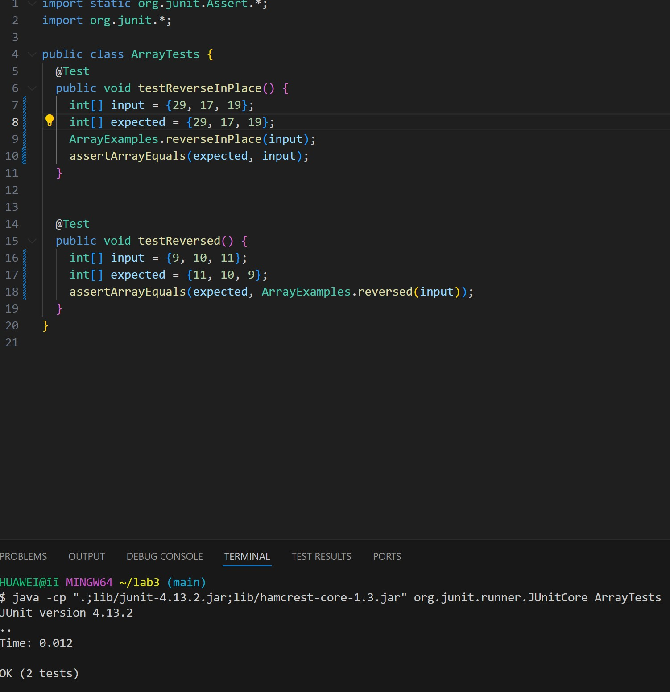

# Part1:
 
 
Failure inducing input:a. {29, 17, 19}; b. {9, 10, 11} 
Suggestion: There is an issue with the result variable in `ArrayExamples.java`. Assigned the ith element of the new array to ith element from the end of the original array, then return the new array. And you swap the first and last element until you reach the half of the array. 
 
The bug is the bugs prevent the intended functionality of the reverseInPlace and reversed methods, leading to incorrect results and potential data loss. 
 
 
# Part2:
From my lab experience, I learned how to harness the power of command-line tools for efficient file manipulation and text analysis, significantly improving my data processing skills. Additionally, I discovered the importance of continuous integration (CI) and autograding systems in automating testing and deployment, which has streamlined my workflow. Using debuggers to control processes and troubleshoot code in real-time was another invaluable skill I developed, enhancing my problem-solving capabilities. 
