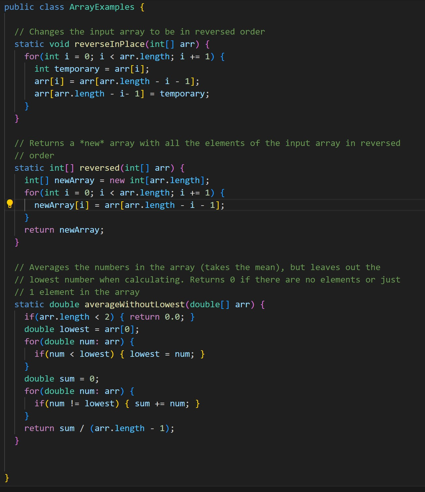

# Part1:
 
 
failure-inducing input is `testFilter2(first assert1)` 
There is an issue with the result variable in `ListEx.java`
 
 
 
# Part2:
From my lab experience, I learned how to harness the power of command-line tools for efficient file manipulation and text analysis, significantly improving my data processing skills. Additionally, I discovered the importance of continuous integration (CI) and autograding systems in automating testing and deployment, which has streamlined my workflow. Using debuggers to control processes and troubleshoot code in real-time was another invaluable skill I developed, enhancing my problem-solving capabilities. 
